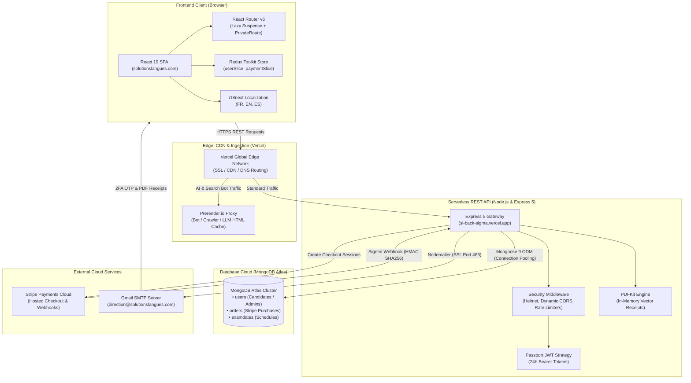
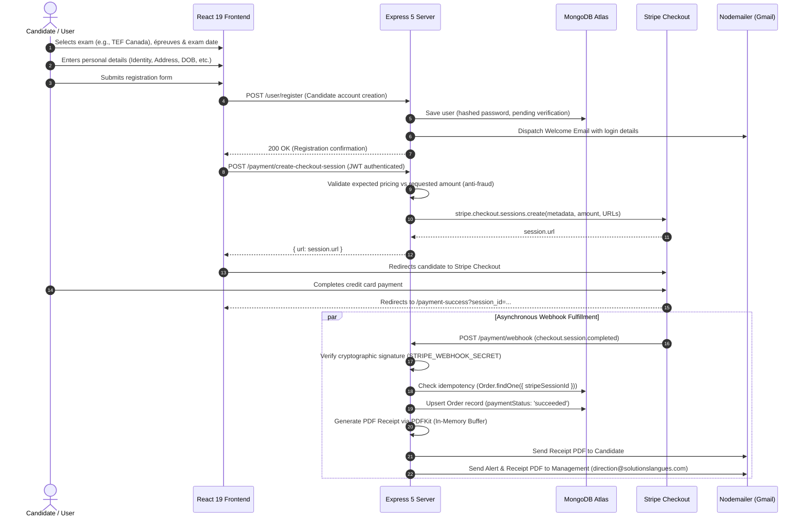
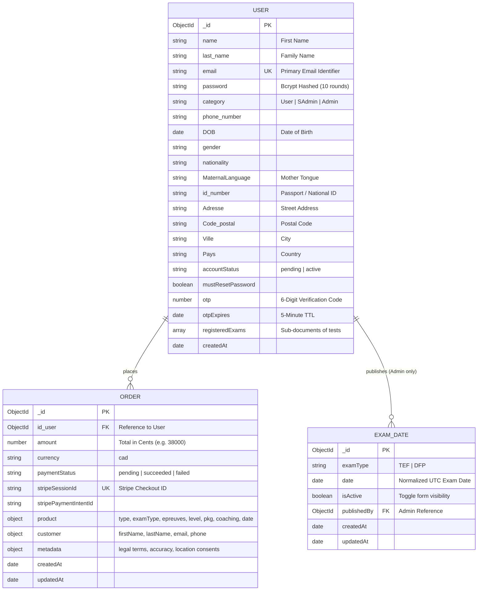
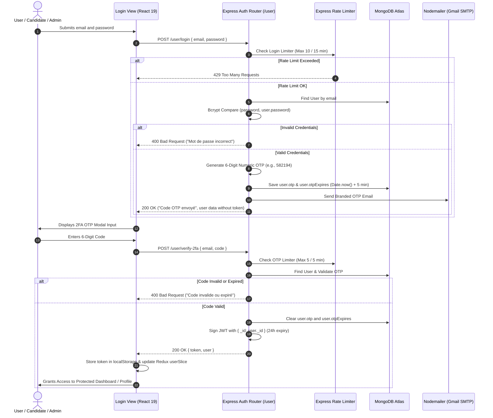
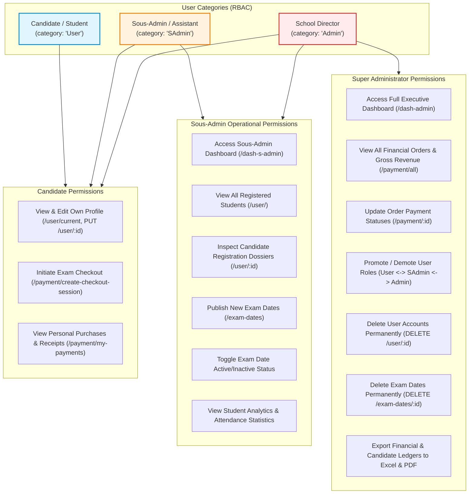
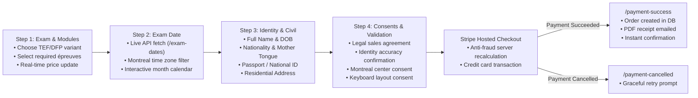
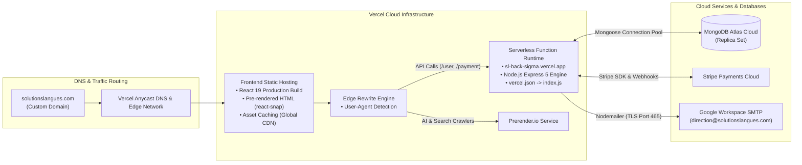

# 📘 Solutions Languages System — Comprehensive Technical Documentation

> **Official web platform and management system for Solutions Langues Québec**, a Canadian language school and certified examination center specializing in adult French language training and official test administration (TEF, DFP, TCF, DELF/DALF).

---

## 📑 Table of Contents

1. [Executive Summary & Project Overview](#1-executive-summary--project-overview)
2. [System Architecture & Cloud Topology](#2-system-architecture--cloud-topology)
   - [Architectural Topology Diagram](#architectural-topology-diagram)
   - [End-to-End Candidate Registration & Checkout Workflow](#end-to-end-candidate-registration--checkout-workflow)
3. [Technology Stack & Tools Directory](#3-technology-stack--tools-directory)
   - [Frontend Ecosystem](#frontend-ecosystem)
   - [Backend Ecosystem](#backend-ecosystem)
   - [Database & Storage](#database--storage)
   - [Third-Party Services & Integrations](#third-party-services--integrations)
   - [DevOps, Build & Deployment Tools](#devops-build--deployment-tools)
4. [Backend Architecture & Implementation](#4-backend-architecture--implementation)
   - [Directory Structure](#backend-directory-structure)
   - [Application Entrypoint & Middleware Pipeline](#application-entrypoint--middleware-pipeline)
   - [Database Schemas & Data Modeling (ER Diagram)](#database-schemas--data-modeling-er-diagram)
   - [Authentication, Security & 2FA OTP Sequence](#authentication-security--2fa-otp-sequence)
   - [Role-Based Access Control (RBAC Hierarchy)](#role-based-access-control-rbac-hierarchy)
   - [Stripe Checkout & Webhook Pipeline](#stripe-checkout--webhook-pipeline)
   - [Automated Email Notification System](#automated-email-notification-system)
   - [API Reference & Endpoint Catalogue](#api-reference--endpoint-catalogue)
5. [Frontend Architecture & Implementation](#5-frontend-architecture--implementation)
   - [Directory Structure](#frontend-directory-structure)
   - [Component, State & Route Architecture](#component-state--route-architecture)
   - [Client Routing & Code-Splitting](#client-routing--code-splitting)
   - [State Management with Redux Toolkit](#state-management-with-redux-toolkit)
   - [Internationalization (i18n) Engine](#internationalization-i18n-engine)
   - [Candidate Exam Registration Journey (Wizard Flow)](#candidate-exam-registration-journey-wizard-flow)
   - [Administrative Dashboards (Admin & Sous-Admin)](#administrative-dashboards-admin--sous-admin)
   - [SEO, Pre-rendering & Crawling Strategy](#seo-pre-rendering--crawling-strategy)
6. [Environment Variables & Configuration](#6-environment-variables--configuration)
7. [Installation, Local Development & Scripts](#7-installation-local-development--scripts)
8. [Production Deployment Architecture](#8-production-deployment-architecture)
9. [Operational Workflows & Best Practices](#9-operational-workflows--best-practices)

---

## 1. Executive Summary & Project Overview

### Context & Purpose
**Solutions Langues Québec** (operating under [solutionslangues.com](https://solutionslangues.com)) is a Quebec-based language school for adults. The institution delivers:
- General French courses across all CEFR (Common European Framework of Reference) levels: **A1, A2, B1, B2, C1, C2**.
- Specialized **Business French** (*Français des Affaires*) for corporate professionals, international teams, and newcomers.
- Certified preparation and official examination administration for international certifications required for Canadian and Quebec immigration, university admission, and professional licensing:
  - **TEF** (*Test d'Évaluation de Français*): TEF Canada, TEFAQ (Québec), TEF Naturalisation, TEF Études.
  - **TCF** (*Test de Connaissance du Français*): TCF Canada, TCF Québec, TCF IRN.
  - **DELF / DALF**: Official French diplomas awarded by the French Ministry of Education.
  - **DFP** (*Diplômes de Français Professionnel*): Certified by the Paris Île-de-France Chamber of Commerce and Industry (CCI Paris Île-de-France) in Business, Healthcare, Tourism, and International Relations.
  - **PrepMyFuture**: Digital interactive test preparation licenses.

### System Objectives
The **Solutions Languages System** provides a unified, end-to-end digital platform that manages:
1. **Public Marketing & Educational Content**: Showcasing course programs, pricing, timetables, pedagogic approaches, and learning tracks with multi-language support (French, English, Spanish).
2. **Online Exam Registration & Custom Scheduling**: Multi-step candidate enrollment forms linked to real-time exam calendars managed directly by administrative staff.
3. **E-Commerce & Secure Payments**: Integration with Stripe Hosted Checkout supporting multi-item calculations (exam test components + optional one-on-one coaching hours) with automated server-side fraud prevention and validation.
4. **Automated Order Fulfillment**: Webhook-driven order generation, PDF receipt creation with PDFKit, and dual email confirmations (candidate & administration) with attachments.
5. **Two-Factor Authenticated User Portals**: Student/candidate portal with OTP login to view account credentials, registered tests, and payment transaction receipts.
6. **Dual Back-Office Admin Dashboards**: Complete management suite for `Admin` (Director) and `SAdmin` (Sous-Admin / Assistant) to manage users, orders, financial analytics, revenue charts, exam schedules, and bulk data export to Microsoft Excel and PDF.

---

## 2. System Architecture & Cloud Topology

### Architectural Topology Diagram



---

### End-to-End Candidate Registration & Checkout Workflow



---

## 3. Technology Stack & Tools Directory

### Frontend Ecosystem
| Technology / Library | Version | Description & Role in Project |
| :--- | :--- | :--- |
| **React** | `^19.2.3` | Core UI library for modern component-driven single-page architecture. |
| **React DOM** | `^19.2.3` | Document Object Model rendering engine for React 19. |
| **React Scripts** | `^5.0.1` | Build tooling, webpack bundling, and dev server orchestration. |
| **Redux Toolkit** | `^2.11.2` | Centralized state management; handles asynchronous slices (`userSlice`, `paymentSlice`). |
| **React Redux** | `^9.2.0` | Official React bindings for Redux store connection and dispatch hooks. |
| **React Router DOM** | `^6.30.2` | Client-side routing, nested layouts, programmatic navigation, and route guards. |
| **Bootstrap** | `^5.3.8` | Responsive design grid system, utility classes, and typography baseline. |
| **React Bootstrap** | `^2.10.10` | React-native Bootstrap components (Modals, Navbars, Forms, Buttons, Badges). |
| **Bootstrap Icons** | `^1.13.1` | Vector icon pack for UI controls and navigation. |
| **React Icons** & **Lucide React** | `^5.5.0` / `^0.562.0` | Comprehensive iconography for dashboards, feature lists, and buttons. |
| **Framer Motion** | `^12.34.0` | Production-grade animations, page transitions, modal spring physics, and animated numbers. |
| **i18next** & **React-i18next** | `^25.7.4` / `^16.5.3` | Multi-language translation engine (French `fr`, English `en`, Spanish `es`). |
| **Axios** | `^1.13.2` | HTTP client with bearer token interception, headers configuration, and error handling. |
| **SweetAlert2** | `^11.26.17` | Beautiful, accessible modal dialogs, alerts, and deletion confirmations. |
| **jsPDF** & **jsPDF-AutoTable**| `^4.2.1` / `^5.0.7` | Client-side PDF generation for downloading orders and candidate lists from admin dashboards. |
| **XLSX (SheetJS)** | `^0.18.5` | Client-side Excel `.xlsx` spreadsheet exporter for accounting, candidate lists, and orders. |
| **React Helmet Async** | `^3.0.0` | Dynamic `<head>` tag manager for per-page titles, descriptions, and OpenGraph metadata. |
| **React Fast Marquee** | `^1.6.5` | Smooth scrolling marquee for accreditation badges, partners, and institution logos. |
| **React Country Flag** / **Flag Icons** | `^3.1.0` / `^7.5.0` | Visual country flags in the language selector and candidate nationality fields. |
| **EmailJS Browser** | `^4.4.1` | Client-side fallback email dispatch for quick contact requests. |
| **react-snap** | `^1.23.0` | Static pre-rendering crawling tool that renders static HTML at build time for critical SEO pages. |

### Backend Ecosystem
| Technology / Library | Version | Description & Role in Project |
| :--- | :--- | :--- |
| **Node.js** | `>=18.x` | JavaScript asynchronous server runtime environment. |
| **Express** | `^5.2.1` | Next-generation web framework handling HTTP routing, middleware, and request/response flow. |
| **Mongoose** | `^9.0.2` | Object Data Modeling (ODM) library for MongoDB; schema definitions, validation, and population. |
| **Passport** & **Passport-JWT** | `^0.7.0` / `^4.0.1` | Bearer token authentication middleware extracting and validating JWT tokens against database users. |
| **JSONWebToken (jsonwebtoken)** | `^9.0.3` | Cryptographic signing and verification of user session tokens (24-hour expiration). |
| **Bcrypt** & **Bcryptjs** | `^6.0.0` / `^3.0.3` | Industrial-standard salted password hashing (salt rounds: 10). |
| **Stripe Node SDK** | `^20.1.1` | Official Stripe API client for Hosted Checkout Sessions, metadata passing, and webhook validation. |
| **PDFKit** | `^0.18.0` | Server-side vector PDF generation stream engine used to build official branded payment receipts. |
| **Nodemailer** | `^7.0.11` | Enterprise email transport client utilizing SMTP (SSL/TLS port 465) for OTPs and transaction receipts. |
| **Helmet** | `^8.1.0` | Comprehensive HTTP security headers (X-Frame-Options, CSP, HSTS, X-Content-Type-Options). |
| **Express Rate Limit** | `^8.3.2` | Anti-abuse rate limiting for authentication endpoints and OTP dispatch prevention. |
| **Express Validator** | `^7.3.1` | Middleware suite for validating and sanitizing email, passwords, and user input. |
| **CORS** | `^2.8.5` | Cross-Origin Resource Sharing whitelist policy allowing authorized domains and Vercel previews. |
| **Dotenv** | `^17.2.3` | Environment variable loader from `.env` files for local development. |
| **Nodemon** | `^3.1.11` | Developer tool that monitors file changes and restarts the backend process automatically. |

### Database & Storage
- **MongoDB Atlas**: Managed multi-region cloud database cluster (`cluster0.3aecon3.mongodb.net`).
  - Collections: `users`, `orders`, `examdates`.
  - Native unique compound indexes on `{ examType: 1, date: 1 }` to prevent scheduling collisions.

### Third-Party Services & Integrations
- **Stripe Payments**: Hosted Checkout and webhook events with HMAC-SHA256 signature verification.
- **Google Workspace / Gmail SMTP**: Secure App Password transport (`direction@solutionslangues.com`).
- **Prerender.io**: Dynamic rendering proxy intercepting bots and web crawlers.

---

## 4. Backend Architecture & Implementation

### Backend Directory Structure
```
server/
├── config/
│   └── email.js              # Nodemailer transporter configuration (Gmail SMTP)
├── middleware/
│   ├── passport.js           # JWT Bearer strategy and isAuth middleware
│   └── validator.js          # Express-validator rules for registration & login
├── models/
│   ├── ExamDate.js           # ExamDate schema with compound unique indexing
│   ├── Order.js              # Order schema with Stripe metadata & customer snapshot
│   └── user.js               # User schema with RBAC, OTP, and registered exams
├── routes/
│   ├── examDates.js          # Calendar management & public date availability endpoints
│   ├── payment.js            # Stripe checkout, webhook, receipt PDF & order CRUD
│   └── user.js               # Auth, registration, 2FA OTP verification & user management
├── utils/
│   └── emailTemplates.js     # Responsive HTML email templates for all transaction types
├── .env                      # Environment secret configuration (omitted in git)
├── .env.example              # Environment secret template
├── .gitignore                # Git exclusions (node_modules, logs, .env)
├── connect_db.js             # Mongoose connection handler with connection pooling reuse
├── index.js                  # Express app bootstrap, middleware chain & listener
├── package.json              # Server dependencies & scripts
└── vercel.json               # Serverless route mapping configuration for Vercel
```

---

### Database Schemas & Data Modeling (ER Diagram)

The application models its domain in MongoDB Atlas via Mongoose across three core entities: `User`, `Order`, and `ExamDate`:



---

### Authentication, Security & 2FA OTP Sequence

The authentication system employs **Defense-in-Depth** security: rate-limiting brute-force attempts, hashing passwords with salted Bcrypt, requiring an email OTP with a 5-minute time-to-live, and issuing stateless 24-hour signed JWT tokens upon success:



---

### Role-Based Access Control (RBAC Hierarchy)



---

### Stripe Checkout & Webhook Pipeline

1. **Server-Side Price Validation**:
   In `server/routes/payment.js`, the server recalculates the exact expected price based on the package and coaching hours to prevent client-side price tampering:
   ```javascript
   let expectedAmount = 0;
   if (product.type === "TEF" || product.type === "DELF" || product.type === "DALF") {
     const basePriceCents = product.pkg === "10" ? 30000 : product.pkg === "6" ? 20000 : 0;
     const coachingPriceCents = product.coachingActive ? (product.coachingHours || 0) * 5500 : 0;
     expectedAmount = basePriceCents + coachingPriceCents;
   } else if (product.type === "DFP") {
     expectedAmount = product.examType?.includes("A2") ? 13500 : 16000;
   } else if (product.type === "PrepMyFuture") {
     expectedAmount = 12000; // $120.00 CAD
   }
   if (expectedAmount > 0 && amount < expectedAmount) {
     return res.status(400).json({ error: "Le montant envoyé ne correspond pas au tarif en vigueur" });
   }
   ```

2. **Webhook Idempotency**:
   The webhook handler inspects `Order.findOne({ stripeSessionId: session.id })`. If an order already exists for this Stripe session, processing halts immediately, preventing duplicate order records or double emails.

3. **In-Memory PDF Receipt Generation**:
   Using `PDFKit`, the webhook compiles a branded PDF receipt directly in an in-memory buffer stream (`pdfBuffer`) without writing temporary files to disk, making it 100% compatible with serverless ephemeral filesystems.

4. **Dual Email Notification**:
   - **Candidate**: Receives a personalized confirmation email with order breakdown and the generated PDF receipt attached.
   - **School Management (`direction@solutionslangues.com`)**: Receives an instant transaction advisory containing candidate identification, exam selected, total revenue, and the identical PDF receipt.

---

### API Reference & Endpoint Catalogue

#### Authentication & User Endpoints (`/user`)
| Method | Endpoint | Auth Required | Description |
| :--- | :--- | :--- | :--- |
| `POST` | `/user/register` | Public | Validates and registers a new candidate profile. Sends welcome email. |
| `POST` | `/user/login` | Public (Rate Limited)| Validates password, generates 6-digit OTP, sends email. |
| `POST` | `/user/verify-2fa` | Public (Rate Limited)| Validates OTP code; returns JWT Bearer token on success. |
| `POST` | `/user/resend-2fa` | Public (Rate Limited)| Regenerates and dispatches a fresh OTP code. |
| `GET` | `/user/current` | Bearer JWT | Returns current authenticated user record. |
| `GET` | `/user/` | Admin / SAdmin | Lists all registered users (excluding passwords and OTPs). |
| `PUT` | `/user/:id` | Bearer JWT (Self/Admin)| Updates candidate information or role (Admin only). |
| `DELETE`| `/user/:id` | Admin only | Deletes a user account permanently. |

#### Payment & Checkout Endpoints (`/payment`)
| Method | Endpoint | Auth Required | Description |
| :--- | :--- | :--- | :--- |
| `POST` | `/payment/create-checkout-session` | Bearer JWT | Validates amounts and creates a Stripe Checkout Session URL. |
| `GET` | `/payment/session-status` | Public (Stripe Session)| Checks if a Stripe session has been paid. |
| `POST` | `/payment/webhook` | Stripe Signature | Listens for `checkout.session.completed` events from Stripe. |
| `GET` | `/payment/my-payments` | Bearer JWT | Returns order and purchase history for logged-in user. |
| `GET` | `/payment/all` | Admin / SAdmin | Returns all platform orders with populated candidate data. |
| `PUT` | `/payment/:id` | Admin / SAdmin | Updates order status or notes. |

#### Exam Dates Endpoints (`/exam-dates`)
| Method | Endpoint | Auth Required | Description |
| :--- | :--- | :--- | :--- |
| `GET` | `/exam-dates/:examType` | Public | Returns upcoming active dates for `TEF` or `DFP` (time-zone filtered for `America/Montreal`). |
| `GET` | `/exam-dates/admin/all` | Admin / SAdmin | Retrieves all past, present, and inactive dates with publisher info. |
| `POST` | `/exam-dates` | Admin / SAdmin | Adds one or multiple exam dates (duplicate dates are safely ignored). |
| `PUT` | `/exam-dates/:id` | Admin / SAdmin | Toggles an exam date between `active` and `inactive`. |
| `DELETE`| `/exam-dates/:id` | Admin only | Deletes an exam date from the schedule. |

---

## 5. Frontend Architecture & Implementation

### Frontend Directory Structure
```
client/
├── public/
│   ├── index.html            # Single page HTML template with SEO schema
│   ├── llms.txt              # LLM-readable summary for AI agents and search engines
│   ├── robots.txt            # Search crawler directives
│   ├── sitemap.xml           # XML sitemap of all public school URLs
│   └── [logos & images]      # Institution brand assets, textbook covers, team photos
├── src/
│   ├── components/
│   │   ├── TEF_UI/           # Dedicated step indicator, sidebar & footer for TEF
│   │   ├── About.js          # School history, accreditation, team & pedagogical mission
│   │   ├── BusinessFrench.js # Business French curriculum, corporate training & pricing
│   │   ├── ConditionDeVente.js # Legal sales terms, refund policies, exam regulations
│   │   ├── Contact.js        # Contact details, interactive Google Map, direct form
│   │   ├── DashAdmin.js      # Comprehensive director dashboard (Users, Orders, Charts, Dates)
│   │   ├── DashSousAdmin.js  # Assistant back-office (Candidate management, Dates, Stats)
│   │   ├── DelfDalf.js       # DELF/DALF training programs & coaching packages modal
│   │   ├── FormDFP.js        # Multi-step DFP registration form & Stripe integration
│   │   ├── FormTef.js        # Multi-step TEF registration form with dynamic calendar
│   │   ├── FrenchCourses.js  # General French levels (A1 to C2) syllabus & schedules
│   │   ├── Home.js           # Main landing page (Hero, Certifications, Stats, Testimonials)
│   │   ├── Login.js          # Authentication portal (Email/Pass + 2FA OTP modal)
│   │   ├── Navbarr.js        # Responsive navigation bar with language dropdown
│   │   ├── Otp.js            # Standalone OTP verification fallback
│   │   ├── PaymentCancelled.js # Payment cancellation redirect view
│   │   ├── PaymentSuccess.js # Post-payment confirmation view with order status polling
│   │   ├── PrepMyFuture.js   # PrepMyFuture digital platform modules & access purchase
│   │   ├── Profile.js        # Student profile view & purchases tab
│   │   ├── ProfileUser.js    # Admin view of specific candidate dossier
│   │   ├── Purchases.js      # Student transaction history component
│   │   ├── SEO.js            # React Helmet wrapper for open-graph & meta tags
│   │   ├── TCF.js            # TCF examination overview, modules & requirements
│   │   ├── TEF.js            # TEF examination overview, scoring, and registration CTA
│   │   └── *.css             # Modular component stylesheets
│   ├── i18n/
│   │   ├── locales/
│   │   │   ├── en.json       # English translations (74KB)
│   │   │   ├── es.json       # Spanish translations (77KB)
│   │   │   └── fr.json       # French translations (79KB)
│   │   └── index.js          # i18next initialization and language detector configuration
│   ├── Redux/
│   │   ├── paymentSlice.js   # Checkout session creation & my-payments state
│   │   ├── store.js          # Redux Toolkit store setup
│   │   └── userSlice.js      # User registration, login, 2FA, token management & profile state
│   ├── routes/
│   │   └── PrivateRouter.js  # Protected route outlet checking Redux authentication
│   ├── App.css               # Global application styling
│   ├── App.js                # Root route definitions, code-splitting & Suspense
│   └── index.js              # React 19 root mounting with Provider & HelmetProvider
├── package.json              # Client dependencies, scripts & reactSnap config
└── vercel.json               # Edge rewrite configuration for prerender.io crawler support
```

---

### Component, State & Route Architecture

```mermaid
flowchart TD
    subgraph Root["React 19 Bootstrap (index.js & App.js)"]
        Index["index.js (Provider, HelmetProvider, BrowserRouter)"]
        App["App.js (Routes, Suspense Loader, Language Sync)"]
        Nav["Navbarr.js (Global Navigation & i18n Switcher)"]
        Foot["Footer.js (Accreditation Badges & Legal Links)"]
        Index --> App
        App --> Nav
        App --> Foot
    end

    subgraph State["Redux Toolkit Centralized Store (store.js)"]
        UserSlice["userSlice\n(user, token, 2FA status, profile CRUD)"]
        PaymentSlice["paymentSlice\n(checkout session, my payments, loading)"]
    end

    subgraph PublicRoutes["Public Lazy-Loaded Pages (Code Splitting)"]
        Home["Home.js (Hero, Certifications, Stats, Testimonials)"]
        About["About.js (Mission, Team, Canadian Accreditations)"]
        Courses["FrenchCourses.js & BusinessFrench.js (A1-C2 Syllabus)"]
        Exams["TEF.js, TCF.js, DelfDalf.js, PrepMyFuture.js"]
        RegTEF["FormTef.js (Multi-Step TEF Registration Wizard)"]
        RegDFP["FormDFP.js (Multi-Step DFP Registration Wizard)"]
        LoginView["Login.js (Credentials + 2FA OTP Modal)"]
        PaySuccess["PaymentSuccess.js & PaymentCancelled.js"]
        Legal["ConditionDeVente.js & Contact.js"]
    end

    subgraph GuardedRoutes["Protected Routes (<PrivateRoute />)"]
        Profile["Profile.js & Purchases.js (Student Portal)"]
        AdminDash["DashAdmin.js (Director Suite: Orders, Analytics, Users, Dates)"]
        SAdminDash["DashSousAdmin.js (Assistant Suite: Dossiers, Dates, Stats)"]
        UserDetail["ProfileUser.js (Candidate Dossier Inspection)"]
    end

    App --> PublicRoutes
    App --> GuardedRoutes
    PublicRoutes -.-> State
    GuardedRoutes -.-> State
```



---

### Candidate Exam Registration Journey (Wizard Flow)



---

### Client Routing & Code-Splitting
In `client/src/App.js`, routes are separated into two tiers to optimize First Contentful Paint (FCP) and Lighthouse performance:
1. **Eager Loaded (Critical Path)**: `Navbarr`, `Home`, `PrivateRoute`, and `ProfileUser`.
2. **Lazy Loaded (`React.lazy` + `React.Suspense`)**: Secondary pages (`About`, `FrenchCourses`, `BusinessFrench`, `TEF`, `TCF`, `DelfDalf`, `FormTef`, `FormDFP`, `Login`, `DashAdmin`, etc.) are partitioned into asynchronous JavaScript chunks loaded on-demand.
3. **Protected Routes (`PrivateRoute.js`)**: Wrapped via `<PrivateRoute />` checking `useSelector((state) => state.user)`. Unauthenticated requests redirect automatically to `/login` or `/`.

### State Management with Redux Toolkit
- **`userSlice`**: Manages candidate registration, login credentials, OTP 2FA submission, JWT Bearer token lifecycle, profile updates, and active session caching.
- **`paymentSlice`**: Coordinates Stripe checkout initiation, loading spinners, and order retrieval for candidate profile history.

### Internationalization (i18n) Engine
Trilingual localization powered by `i18next` and `react-i18next`:
- 🇫🇷 **Français (`fr`)** — Primary default language.
- 🇬🇧 **English (`en`)** — Full site localization for international immigrants and students.
- 🇪🇸 **Español (`es`)** — Full site localization for Latin American candidates.

---

### Administrative Dashboards (`DashAdmin.js` & `DashSousAdmin.js`)
- **KPIs & Financial Analytics**: Gross revenue, registration counts, success metrics, and trend charts.
- **Candidate Roster Management**: Search, filter, inspect registration dossiers, and manage access roles.
- **Orders & Transactions**: Real-time payment verification, status tracking, and single-click **Export to Excel (`.xlsx`)** and **Export to PDF**.
- **Exam Session Scheduler**: Add single or bulk dates, toggle active/inactive status, and maintain calendar availability.
- **Dark Mode**: Complete interface dark/light theme switching.

---

### SEO, Pre-rendering & Crawling Strategy
1. **`react-helmet-async`**: Injects page-specific meta tags, OpenGraph data, and canonical URLs.
2. **`react-snap`**: Automated build-time Chromium crawler generating static HTML files in `build/` for search engine bots.
3. **Prerender.io Edge Rewrites (`client/vercel.json`)**: Detects bot user agents (`bot|crawler|spider|GPTBot|ClaudeBot|PerplexityBot`) and transparently routes them to Prerender.io.
4. **LLM Manifest (`client/public/llms.txt`)**: Explicit markdown documentation formatted specifically for Large Language Model crawlers.

---

## 6. Environment Variables & Configuration

### Backend (`server/.env`)
| Variable | Description | Example / Format |
| :--- | :--- | :--- |
| `PORT` | Local HTTP port for Express | `5000` |
| `DB_URI` | MongoDB Atlas connection string | `mongodb+srv://<user>:<password>@cluster0...` |
| `SK` | Secret key used to sign and verify JWT tokens | High-entropy string (e.g., `SecretKey2026!`) |
| `EMAIL_USER` | Official SMTP email sender | `direction@solutionslangues.com` |
| `EMAIL_PASS` | Gmail App Password (16 characters) | `xxxx xxxx xxxx xxxx` |
| `STRIPE_SECRET_KEY` | Stripe Secret API key | `sk_live_...` or `sk_test_...` |
| `STRIPE_WEBHOOK_SECRET`| Stripe Webhook signing secret | `whsec_...` |
| `FRONTEND_URL` | Base URL of frontend for checkout redirects | `https://solutionslangues.com` or `http://localhost:3000` |

### Frontend (`client/.env`)
| Variable | Description | Example / Format |
| :--- | :--- | :--- |
| `REACT_APP_API_URL` | Base HTTP URL of the backend API | `https://sl-back-sigma.vercel.app` or `http://localhost:5000` |
| `REACT_APP_STRIPE_PUBLISHABLE_KEY` | Stripe Publishable API Key | `pk_live_...` or `pk_test_...` |

---

## 7. Installation, Local Development & Scripts

### Prerequisites
- **Node.js**: Version 18.x or 20.x LTS installed.
- **npm**: Version 9.x or higher.
- **MongoDB**: Access to MongoDB Atlas cloud database or local MongoDB instance.
- **Stripe Account**: For test keys and webhook forwarding.

### 1. Repository Setup & Backend Launch
```bash
# Navigate to backend directory
cd server

# Install dependencies
npm install

# Start backend development server (with nodemon)
npm start
# -> Server running on port 5000
# -> Database connected
```

### 2. Frontend Launch
```bash
# Navigate to client directory in a new terminal
cd client

# Install dependencies
npm install

# Start frontend development server
npm start
# -> Local development server active at http://localhost:3000
```

---

## 8. Production Deployment Architecture



The system is deployed on the **Vercel Cloud Platform**:
- **Frontend**: Hosted with automatic CI/CD from the repository branch with custom domain assignment (`solutionslangues.com`).
- **Backend API**: Hosted as a Serverless Node.js Function (`sl-back-sigma.vercel.app`) using `server/vercel.json`.
- **Database**: High-availability MongoDB Atlas cloud cluster.
- **Payment Processing**: Stripe Cloud with Webhook listener at `https://sl-back-sigma.vercel.app/payment/webhook`.

---

## 9. Operational Workflows & Best Practices

1. **Publishing New Exam Dates**:
   - Access `DashAdmin` or `DashSousAdmin` at `/dash-admin` or `/dash-s-admin`.
   - Go to **Dates d'examens** -> Choose exam type (`TEF` or `DFP`).
   - Pick dates on the calendar and click **Ajouter les dates**.
   - Dates immediately appear in the candidate registration picker.
2. **Exporting Candidate Lists for Official Authorities**:
   - In `DashAdmin` under **Commandes**, filter by exam date or exam type.
   - Click **Télécharger Excel (XLSX)** to export the verified roster with candidate full names, birth dates, passport numbers, and selected components.
3. **Audit & Reconciliation**:
   - Compare Stripe Dashboard gross volume against `Order` records in `DashAdmin` to verify that webhook deliveries are running at 100% success.

---

## 10. Contributors & License

- **Platform Architect & Developer**: Amira Zidi
- **Owner & Examination Center**: Solutions Langues Québec ([solutionslangues.com](https://solutionslangues.com))
- **Headquarters**: Québec, Canada
- **Support**: `contact@solutionslangues.com` | `direction@solutionslangues.com`
- **Copyright**: © 2026 Solutions Langues. All rights reserved.
