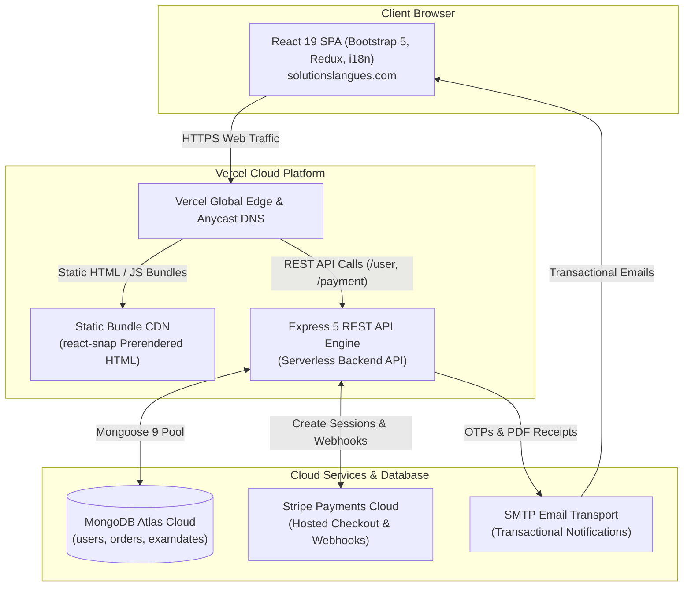

# 🌐 Solutions Languages System

[](https://react.dev/)
[](https://nodejs.org/)
[](https://expressjs.com/)
[](https://www.mongodb.com/)
[](https://stripe.com/)
[](https://vercel.com/)
[](https://solutionslangues.com)

> Comprehensive digital platform and examination administration system for **Solutions Langues Québec** ([solutionslangues.com](https://solutionslangues.com)) — certified French language school and official exam center for **TEF**, **TCF**, **DFP**, and **DELF/DALF** certifications based in Canada.

---

## 📌 Quick Links

- 📖 **[Comprehensive Technical Documentation (DOCUMENTATION.md)](./DOCUMENTATION.md)** — In-depth architectural blueprint, API specifications, data models, workflows, and security.
- 🖥️ **[Frontend Documentation](./client/README.md)** — React 19 architecture, components, i18n, and state management.
- ⚙️ **[Backend Documentation](./server/README.md)** — Express 5 REST API, Passport JWT, Stripe webhooks, and Nodemailer.

---

## 🌟 Key Highlights & Capabilities

- **Official Exam Enrollment Engine**:
  - Interactive multi-step registration forms for **TEF** (TEF Canada, TEFAQ, TEF Naturalisation, TEF Études) and **DFP** (Business, Healthcare, Tourism, International Relations).
  - Dynamic visual calendar date picker synchronized with live database schedules.
- **E-Commerce & Stripe Integration**:
  - Secure credit card checkout supporting test module combinations and optional private coaching hours.
  - Server-side anti-fraud price validation.
  - Asynchronous webhook fulfillment with cryptographic signature verification.
  - Automated PDF invoice receipt generation using **PDFKit** and instant delivery via **Nodemailer**.
- **Two-Factor Authentication (2FA OTP)**:
  - Password encryption via **Bcrypt** (salt rounds: 10).
  - Time-limited (5-minute) 6-digit One-Time Password sent to candidate emails.
  - Rate limiting on brute-force attempts.
  - Stateless authentication using **Passport JWT Bearer tokens**.
- **Role-Based Back-Office Dashboards**:
  - **`Admin` (Director Dashboard)**: Real-time financial analytics, revenue charts, candidate dossier inspection, role promotion, order status modification, and exam schedule management.
  - **`SAdmin` (Sous-Admin Dashboard)**: Candidate attendance, scheduling, and operational tracking.
  - **Data Export**: Single-click export to **Microsoft Excel (`.xlsx`)** and **PDF** via `xlsx` and `jsPDF-AutoTable`.
- **Trilingual Internationalization (i18n)**:
  - Seamless toggle between **Français (`fr`)**, **English (`en`)**, and **Español (`es`)** with over 230 KB of structured localization strings.
- **Production SEO & Bot Crawling Strategy**:
  - Headless Chromium pre-rendering with **react-snap**.
  - Dynamic metadata injection via **react-helmet-async**.
  - Edge routing rewrites for AI crawlers (GPTBot, ClaudeBot, PerplexityBot) through **Prerender.io**.
  - Machine-readable manifest at `/llms.txt`.

---

## 🏗️ High-Level System Architecture



---

## 📁 Repository Structure

```
Solution Languages System/
├── client/                     # Frontend Application (React 19, Redux Toolkit, Bootstrap 5)
│   ├── public/                 # Static assets, logos, sitemap, llms.txt, index.html
│   ├── src/                    # Components, i18n locales, Redux slices, CSS
│   │   ├── components/         # Pages, Modals, Forms (FormTef, FormDFP, DashAdmin...)
│   │   ├── i18n/               # Localization bundles (fr.json, en.json, es.json)
│   │   ├── Redux/              # Global store, userSlice, paymentSlice
│   │   ├── routes/             # Protected routing guards
│   │   └── App.js              # Routing table & Suspense code splitting
│   ├── package.json            # Frontend dependencies & react-snap config
│   └── vercel.json             # Edge crawler rewrite configuration
│
├── server/                     # Backend Application (Node.js, Express 5, Mongoose 9)
│   ├── config/                 # Transporters (Nodemailer Gmail configuration)
│   ├── middleware/             # Passport JWT strategy, Express-Validator schemas
│   ├── models/                 # Mongoose schemas (User, Order, ExamDate)
│   ├── routes/                 # REST endpoints (user, payment, examDates)
│   ├── utils/                  # HTML email templates
│   ├── connect_db.js           # Resilient MongoDB Atlas connection handler
│   ├── index.js                # Server entry point & middleware configuration
│   ├── package.json            # Backend dependencies
│   └── vercel.json             # Serverless routing for Vercel
│
├── DOCUMENTATION.md            # Master technical manual and system architecture
└── README.md                   # Project overview & developer guide
```

---

## 🧰 Technology Stack & Tools Summary

| Area | Primary Technologies & Libraries |
| :--- | :--- |
| **Frontend** | React 19, Redux Toolkit, React Router v6, Bootstrap 5, React-Bootstrap, Framer Motion, Axios, i18next, React-Helmet-Async, SweetAlert2, jsPDF, XLSX |
| **Backend** | Node.js, Express 5, Mongoose 9, Passport.js, Passport-JWT, Bcrypt, Stripe SDK, PDFKit, Nodemailer, Helmet, Express-Rate-Limit, Express-Validator |
| **Database** | MongoDB Atlas (Multi-region Cloud Cluster) |
| **Integrations** | Stripe Hosted Checkout & Webhooks, Google Workspace / SMTP, Prerender.io |
| **Deployment** | Vercel Serverless Functions (REST API) + Vercel Static Frontend (Custom Domain) |

---

## 🛡️ Security Architecture

1. **Authentication**: Bcrypt-hashed credentials + email-delivered 6-digit OTP code (5-minute expiry).
2. **Authorization**: JWT Bearer token inspected on every protected request with strict role checking (`User`, `SAdmin`, `Admin`).
3. **Financial Protection**:
   - Server-side price recalculation before session creation prevents client request tampering.
   - Raw body HMAC-SHA256 signature verification on Stripe webhooks.
   - Idempotent order processing guarantees transactions are never recorded twice.
4. **Network & Transport**:
   - Helmet HTTP security headers.
   - Strict CORS origin whitelisting.
   - Granular rate limiting on login attempts and OTP generation.

---

## 📄 Documentation & References

For complete architectural details, schema properties, and endpoint payloads, consult:
- 📑 **[DOCUMENTATION.md](./DOCUMENTATION.md)**

---

## 👤 Authors & Intellectual Property

- **Developer**: Amira Zidi
- **Owner & Examination Center**: Solutions Langues Québec ([solutionslangues.com](https://solutionslangues.com))
- **Copyright**: © 2026 Solutions Langues. All rights reserved.
